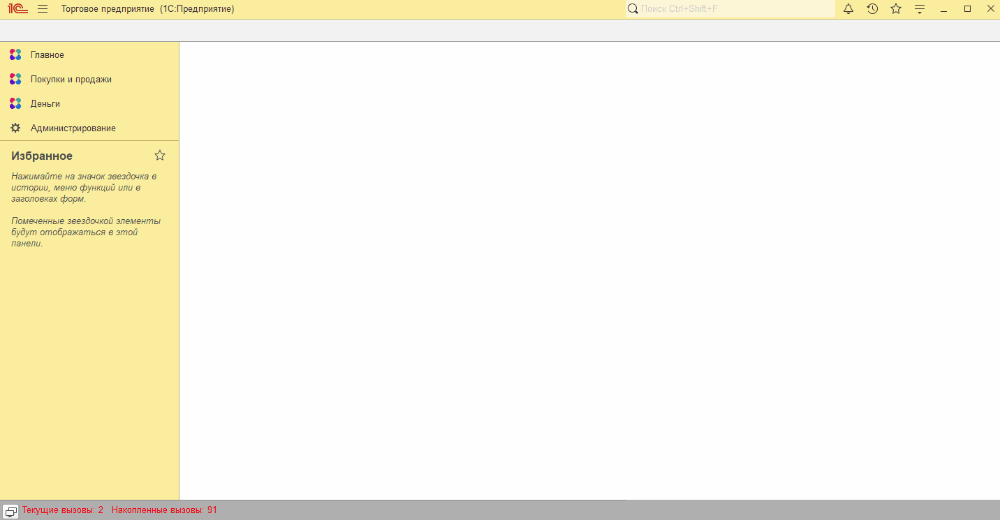
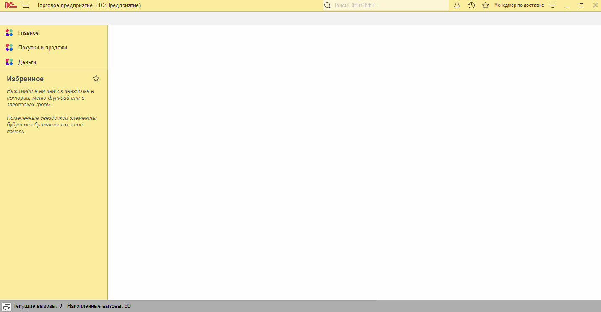

# Занятие "Базовые подсистемы"

## Задача 1 "Работа с файлами"
В системе присутствует документ Доставка. К документу можно прикреплять файлы.

   

## Задача 2 "Связанные документы"
В документе доставка доступен просмотр Связанных документов

   

## Задача 3 "Управление доступом"
В системе создан пользователь Менеджер по доставке, у которого нет прав администратора, но доступны документы Доставка

   

