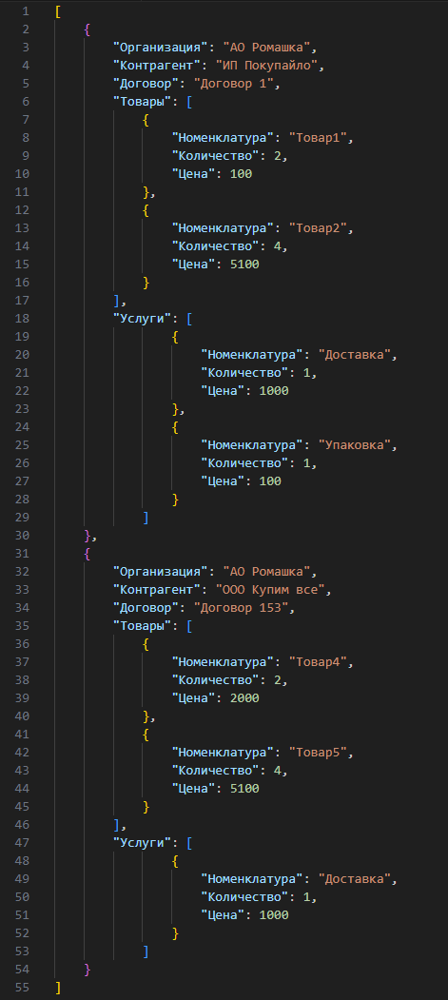

# Домашнее задание к занятию «Дополнительные отчёты и обработки»

### Цель задания
1. Создать контекстный отчёт.
2. Создать обработку, работающую по расписанию.

### Чеклист готовности к домашнему заданию

- [ ] Установить платформу версии 8.3.25 или больше.
- [ ] Подготовить информационную базу, полученную по итогу выполнения [домашнего задания к занятию 12-3](homework-12-3.md).

### Инструкция к заданию

1. Решите описанные задачи в конфигураторе.
2. Протестируйте решение в пользовательском режиме.
3. В личном кабинете Нетологии отправьте на проверку один общий файл базы данных (.dt), содержащий решение по всем 2 задачам. Файл прикрепите в раздел «решение» в практическом задании и пример файла для загрузки Заказов покупателя.

## Задание 1. «Создание контекстного отчёта»

### Описание задачи
По заданию заказчика для документа Заказ покупателя вы хотите реализовать отчёт, который показывает, сколько на складе товара, указанного в выбранном Заказе покупателя.

### Требования к результату
У документа Заказ покупателя на панели действий добавлена команда на открытие контекстного отчёта Остатки товаров по заказу. Отчёт добавлен с помощью подсистемы Дополнительные отчёты и обработки.

### Процесс выполнения

1. Создайте внешний отчёт, назовите его Остатки товаров по заказу.
2. В модуле объекта отчёта разместите метод для интеграции с БСП в качестве внешнего:
```bsl
Функция СведенияОВнешнейОбработке() Экспорт
    ПараметрыРегистрации = ДополнительныеОтчетыИОбработки.СведенияОВнешнейОбработке("2.2.5.1");
    ПараметрыРегистрации.Информация = НСтр("ru = 'Отчет по документа Заказ покупателя'");
    ПараметрыРегистрации.Вид = ДополнительныеОтчетыИОбработкиКлиентСервер.ВидОбработкиОтчет();
    ПараметрыРегистрации.Версия = "2.4.1.1";
    ПараметрыРегистрации.Назначение.Добавить("Документ.ЗаказПокупателя");
    ПараметрыРегистрации.ОпределитьНастройкиФормы = Истина;
    
    Команда = ПараметрыРегистрации.Команды.Добавить();
    Команда.Представление = НСтр("ru = 'Остатки товаров по заказу'");
    Команда.Идентификатор = "Основная";
    Команда.Использование = ДополнительныеОтчетыИОбработкиКлиентСервер.ТипКомандыОткрытиеФормы();
    Команда.ПоказыватьОповещение = Ложь;
    
    Возврат ПараметрыРегистрации;
КонецФункции
```
3. В модуле объекта разместите метод для управления открытием отчёта
```bsl
Процедура ОпределитьНастройкиФормы(Форма, КлючВарианта, Настройки) Экспорт
    Настройки.ФормироватьСразу = Истина;
    Настройки.РазрешеноИзменятьВарианты = Ложь;
    Настройки.События.ПриСозданииНаСервере = Истина;
КонецПроцедуры
```
4. В модуле объекта разместите метод для установки отбора в отчёте
```bsl
Процедура ПриСозданииНаСервере(Форма, Отказ, СтандартнаяОбработка) Экспорт
    ОбъектыНазначения = ОбщегоНазначенияКлиентСервер.СвойствоСтруктуры(Форма.Параметры, "ОбъектыНазначения");
    Если ОбъектыНазначения <> Неопределено Тогда
        Форма.ФормаПараметры.Отбор.Вставить("Заказ", ОбъектыНазначения);
    КонецЕсли;
КонецПроцедуры
```
5. Создайте в отчёте основную схему компоновки данных и реализуйте вывод отчёта со следующими требованиями:
    - отчёт должен содержать колонки: Товар, Количество в заказе, Остаток на складе;
    - в отчёте должна выбираться ссылка на документ заказа с псевданимом Заказ;
    - остатки для простоты получаем на текущую дату (можете подумать, как получить на дату документа, если остатки будут браться на дату документа, это не будет ошибкой).
6. В свойствах отчёта установите Хранилище вариантов отчётов в качестве Хранилища вариантов.
7. Убедитесь, что в определяемый тип «ОбъектСДополнительнымиКомандами» добавлен документ ЗаказПокупателя. При отсутствии — добавьте.
8. Сохраните файл отчёта и добавьте в качестве дополнительного в справочник Дополнительные отчёты и обработки.

### Результат задания
1. Запустите базу в пользовательском режиме.
2. Убедитесь, что на форме документа Заказ покупателя отображается команда для формирования отчёта.
3. Убедитесь, что отчёт формируется корректно.

## Задание 2. «Создание обработки, работающей по расписанию»

### Описание задачи
По заданию заказчика вы хотите реализовать механизм периодической загрузки Заказов покупателя из файлов на диске сервера.

### Требования к результату
В информационную базу добавлена дополнительная обработка, которая запускается по расписанию и из указанного файла загружает Заказы покупателя. После загрузки файл удаляется.

### Процесс выполнения

1. Создайте внешнюю обработку, назовите Загрузка заказов покупателя.
2. В модуле объекта обработки разместите метод для интеграции с БСП в качестве внешнего:

```bsl
Функция СведенияОВнешнейОбработке() Экспорт
    ПараметрыРегистрации = ДополнительныеОтчетыИОбработки.СведенияОВнешнейОбработке("2.2.2.1");
    ПараметрыРегистрации.Информация = НСтр("ru = 'Обработка для загрузки Заказов покупателя'");
    ПараметрыРегистрации.Вид = ДополнительныеОтчетыИОбработкиКлиентСервер.ВидОбработкиДополнительнаяОбработка();
    ПараметрыРегистрации.Версия = "3.0.2.118";
    ПараметрыРегистрации.БезопасныйРежим = Ложь;
    
    Команда = ПараметрыРегистрации.Команды.Добавить();
    Команда.Представление = НСтр("ru = 'Параметры загрузки'");
    Команда.Идентификатор = "ФормаНастройки";
    Команда.Использование = ДополнительныеОтчетыИОбработкиКлиентСервер.ТипКомандыОткрытиеФормы();
    Команда.ПоказыватьОповещение = Истина;
    
    Команда = ПараметрыРегистрации.Команды.Добавить();
    Команда.Представление = НСтр("ru = 'Загрузка заказов'");
    Команда.Идентификатор = "ЗагрузитьЗаказы";
    Команда.Использование = ДополнительныеОтчетыИОбработкиКлиентСервер.ТипКомандыВызовСерверногоМетода();
    Команда.ПоказыватьОповещение = Ложь;
    
    Возврат ПараметрыРегистрации;
КонецФункции
```

3. Создайте форму ФормаНастройки, сделайте её основной формой обработки:
    - на форму добавьте текстовый реквизит ПутьКФайлуНаСервере;
    - (Важно!) добавьте возможность указать файл при помощи диалога выбора файлов (т.е. у пользователя, обязательно должна быть возможность выбрать файл интерактивно. Оставлять просто текстовое поле для ввода строки - не правильно);
    - добавьте на форму ключевой параметр ДополнительнаяОбработкаСсылка с типом СправочникСсылка.ДополнительныеОтчетыИОбработки;
    - при создании формы на сервере реализуйте чтение сохраненных настроек:

```bsl
    Если ЗначениеЗаполнено(Параметры.ДополнительнаяОбработкаСсылка) Тогда
        ХранилищеНастроек = ОбщегоНазначения.ЗначениеРеквизитаОбъекта(
            Параметры.ДополнительнаяОбработкаСсылка,
            "ХранилищеНастроек");
        Настройки = ХранилищеНастроек.Получить();
        Если ТипЗнч(Настройки) = Тип("Структура") Тогда
            ПутьКФайлуНаСервере = ОбщегоНазначенияКлиентСервер.СвойствоСтруктуры(Настройки, "ПутьКФайлуНаСервере");
        КонецЕсли;
    КонецЕсли;
```

4. Добавьте на форму команду Сохранить и в рамках команды сохраняйте путь к файлу на сервере:

```bsl

&НаКлиенте
Процедура Сохранить(Команда)
    
    СохранитьНастройкиФормы(Параметры.ДополнительнаяОбработкаСсылка, ПутьКФайлуНаСервере);
    Закрыть();
    
КонецПроцедуры

&НаСервереБезКонтекста
Процедура СохранитьНастройкиФормы(ДополнительнаяОбработкаСсылка, ПутьКФайлуНаСервере)
    
    СохраняемоеЗначение = Новый Структура("ПутьКФайлуНаСервере", ПутьКФайлуНаСервере);
    
    ДополнительнаяОбработкаОбъект = ДополнительнаяОбработкаСсылка.ПолучитьОбъект();
    ДополнительнаяОбработкаОбъект.ХранилищеНастроек = Новый ХранилищеЗначения(СохраняемоеЗначение);
    ДополнительнаяОбработкаОбъект.Записать();
    
КонецПроцедуры

```
5. В модуле объекта разместите обработчик для загрузки данных из файла
```bsl
Процедура ВыполнитьКоманду(ИдентификаторКоманды, ПараметрыВыполнения) Экспорт

    Ссылка = ПараметрыВыполнения.ДополнительнаяОбработкаСсылка;
    ХранилищеНастроек = ОбщегоНазначения.ЗначениеРеквизитаОбъекта(Ссылка, "ХранилищеНастроек");
    Настройки = ХранилищеНастроек.Получить();
    Если ТипЗнч(Настройки) = Тип("Структура") Тогда
        ПутьКФайлуНаСервере = ОбщегоНазначенияКлиентСервер.СвойствоСтруктуры(Настройки, "ПутьКФайлуНаСервере");
    Иначе
        // Реализуйте запись информации об отсутствии настройки в журнал регистрации с помощью метода ЗаписьЖурналаРегистрации
        Возврат;
    КонецЕсли;

    ЗагрузитьЗаказыИзФайла(ПутьКФайлуНаСервере);

КонецПроцедуры
```
6. Реализуйте метод ЗагрузитьЗаказыИзФайла, который должен создавать документа Заказы покупателя на основании данных файл:
    - самостоятельно продумайте формат файла, допустимые типы — csv, json, xml. Учитывайте, что в одном файле может содержаться несколько заказов, в каждом из которых несколько строк;
    - после успешной загрузки данных из файла удаляйте файл.
7. Добавьте обработку как дополнительную в справочник Дополнительные отчёты и обработки, настройте путь для хранения файла, проверьте работу обработки.

### Результат задания
1. Запустите базу в пользовательском режиме.
2. Убедитесь, что при запуске регламентного задания с обработкой данные Заказов покупателей загружаются корректно.

<details>
  <summary>Частые ошибки</summary>
  
  1. Отчет должен быть реализован как контекстный отчет документа, то есть, он должен открываться из формы документа и параметр Заказ должен сразу заполняться выбранным документом.
  2. csv - крайне примитивный тип файла. для реальных обменов следует использовать json или xml (в рамках учебной задачи допустим применить csv, но для тренировки, рекомендуем использовать именно json или xml)
  3. НайтиПоНаименованию - это запрос. Запросы в цикле - это плохо. Можно сначала считать все данные в отдельную таблицу значений, а потом получить все данные одним запросом. (опять же, в рамках учебной задачи, использование НайтиПоНаименованию и НайтиПоКоду - допустимо, хотя и не приветствуется)
  4. Рекомендуем для загрузки данных не использовать СерилизаторXDTO. В реальной задаче, практически, никогда у вас не будет файла в таком формате, который может прочитать сериализатор. Такой файл возможен только при обмене между идентичными конфигурациями. В реальности, у вас будет файл, содержащий не ссылки на объекты, а просто их наименования, например:

<p align="center" width="100%">
   
</p>

</details>

### Критерии оценки

1. Зачёт — выполнены все задания, в выполненных заданиях нет противоречий и нарушения логики. 
2. На доработку — задание выполнено частично или не выполнено, в логике выполнения заданий есть противоречия, существенные недостатки.

Все задачи обязательны к выполнению. Пожалуйста, присылайте на проверку все задачи сразу.

Любые вопросы по решению задач задавайте в чате учебной группы.

*Примерное время выполнения: 45–240 минут*
