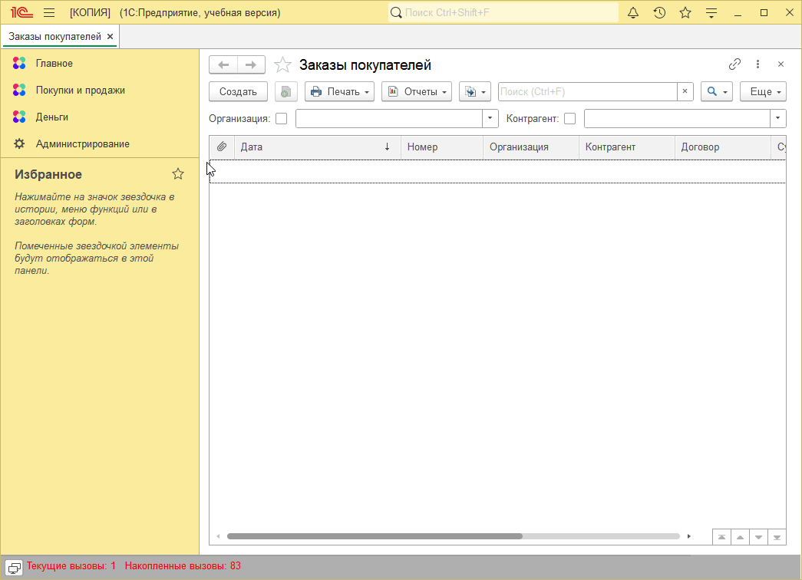

# Задание к занятию "Расширения"

## Задача 1. "Добавление объектов метаданных в расширении"

Допускаются другие варианты реализации интерфейса, на анимации приведен пример.

* К Контактным лицам можно перейти из справочника Контрагентов, можно создать новое Контактное лицо, заполнить его свойства.

* При выборе контрагента в документе, в поле "Контактное лицо" доступен выбор только его контактных лиц, при выборе другого контрагента, поле очищается.

   

## Задача 2. "Доработка программного кода в расширении"

Допускаются другие варианты реализации интерфейса, на анимации приведен пример.

* В документе выведено поле "Согласованная скидка".

* При расчете строки табличной части скидка учитывается.

* Реализована кнопка для пересчета табличной части, с учетом введенной скидки.

* Многократное нажатие на кнопку не приводит к уменьшению суммы.

   

