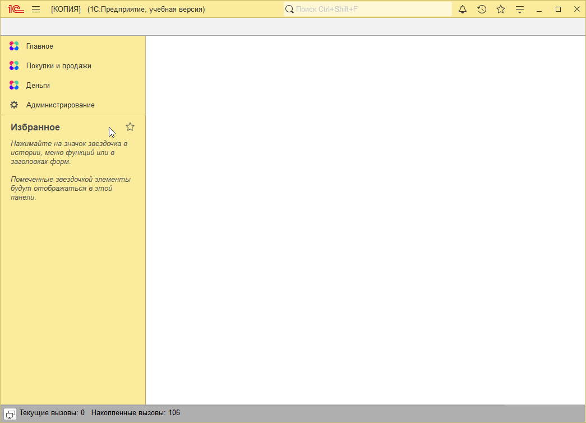

# Задание к занятию "Мехнизм поддержки и обновления"

После корректного обновления, при расчете суммы должна учитываться и скидка из строки табличной части, и скидка из шапки документа.

Если сумма скидок больше 100%, не должна появляться отрицательная сумма, считать что кидка составила 100%

   

