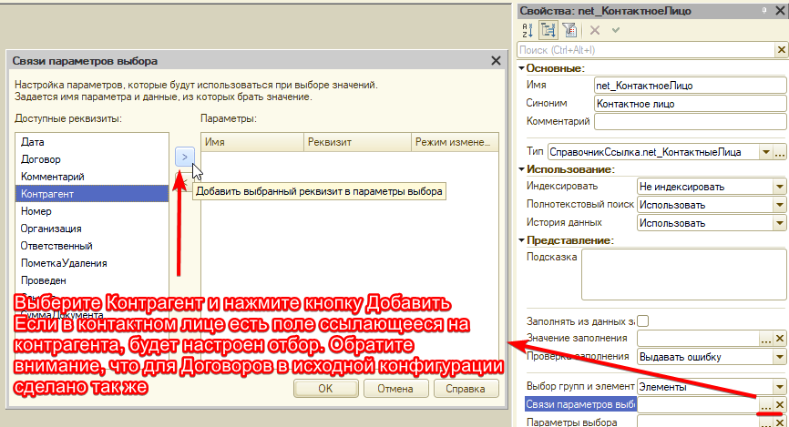

# Домашнее задание к занятию «Расширения»

## Цель задания

1. Научиться создавать собственные расширения для конфигураций 1С.
2. Научиться вносить изменения в конфигурацию, находящуюся на полной поддержке поставщика.

Эта практика научит вас создавать расширения на платформе 1С и вносить изменения в конфигурацию, не включая в ней возможность изменения. Эти навыки пригодятся вам для реальной работы, когда потребуется доработать конфигурацию заказчика.

## Чеклист готовности к домашнему заданию

- [ ] Установить учебную платформу версии 8.3.22 или больше.
- [ ] Просмотреть материал занятия «Расширения».

## Инструкция к заданию

1. Решите описанные задачи в конфигураторе.
2. Протестируйте решение в пользовательском режиме.
3. Отправьте на проверку в личном кабинете Нетологии один общий файл базы данных (.dt), содержащей расширение с решением по обеим задачам. Файл прикрепите в раздел «решение» в практическом задании.

## Задача 1. «Добавление объектов метаданных в расширении»

### Описание задачи
Вы дорабатываете приложение заказчика, использующего конфигурацию на полной поддержке. Заказчик запросил доработку: для Контрагентов необходимо хранить список контактных лиц.

### Требования к результату
При помощи расширения для справочника Контрагенты добавить возможность хранения перечня контактных лиц. Способ реализации функционала допускается любой, на ваше усмотрение. Обязательные требования:
- для Контрагента можно хранить неограниченное количество Контактных лиц;
- Список Контактных лиц должен открываться из формы Контрагента или отображаться на форме в виде списка с возможностью добавления новых контактных лиц и их данных;
- Для контактного лица должна быть возможность указать:
  - ФИО — Строка до 150 символов, обязательно к заполнению;
  - Контактный телефон — Строка до 50 символов, обязательно к заполнению;
  - Должность — Отдельный справочник, обязательно к заполнению;
  - Действует на основании — Строка до 150 символов, необязательно к заполнению;
  - Заметка — Строка неограниченной длины, необязательно к заполнению;
- Во всех формах документов под полем Договор вывести поле Контактное лицо, выбор контактных лиц должен осуществляться по тому Контрагенту, который указан в документе (в базе Заказчика подобный отбор реализован для поля Договора, реализацию можно «подсмотреть» там).

### Процесс выполнения
1. Скачайте конфигурацию Заказчика, [ссылка на файл](https://drive.google.com/file/d/1xLRTOxasKuSFfZhENDUk0mbsUHTqKP5n/view?usp=sharing).
2. Создайте новую базу данных без конфигурации и загрузите в неё скачанную конфигурацию.
3. Продумайте, какие объекты вам понадобятся для решения задачи, как должны выглядеть формы объектов. Возможно, поможет зарисовать всё на бумаге.

  
Подсказка 1

  Очевидно, чтобы была возможность указывать контактных лиц в документах, для их хранения следует использовать справочник.  

  
Подсказка 2

  Кроме перечисленных в требованиях полей, в Контактном лице должна быть возможность указать ссылку на Контрагента, чтобы использовать механизм подбора.
  Чтобы Контактное лицо нельзя было записать без указания Контрагента, лучше сделать Контрагента владельцем контактного лица. При этом стандартный реквизит лучше переименовать.

  
Подсказка 3

  Должности должны храниться в справочнике.

4. Реализуйте решение в расширении. Детали реализации можете выбирать на свой вкус. При необходимости дать пояснения используйте комментарии в коде или допишите пояснение к решению в личном кабинете.

  
Подсказка 4

  Способ вывести реквизит на форму подробно описан в презентации.

  
Подсказка 5

  Для организации отбора Контактных лиц по Контрагентам в реквизите надо настроить связи параметров выбора:
  

     
  

  
Подсказка 6

  Реквизит «Контрагент» перед настройкой отбора должен быть добавлен в расширение.

5. Не забудьте настроить форму объекта справочника так, чтобы с ней было удобно работать, а также задать представления объектов и списков.

6. Дополнительно можно (необязательно) настроить представление Контактного лица так, чтобы, если заполнено поле «Действует на основании», оно бы отображалось в представлении Контактного лица.

## Задача 2. «Доработка программного кода в расширении»

### Описание задачи
Заказчик запросил ещё одну доработку. В документе «Заказ покупателя» необходимо добавить поле «Согласованная скидка», учитывать скидку при расчёте суммы по каждой строке табличной части. То есть сумма в каждой строке табличного документа должна быть уменьшена на указанный в шапке процент.

### Требования к результату
При помощи расширения в документ «Заказ покупателя» должно быть добавлено поле «Согласованная скидка», значение указанное в поле должно учитываться в документе. Для решения задачи следует использовать аннотацию «ИзменениеИКонтроль».

### Процесс выполнения
1. Выполняйте решение в том же расширении, которое вы создали в прошлом задании.
2. Спланируйте решение: какой тип данных должен быть у поля, какая точность, как скидка будет влиять на табличную часть, какие события надо обработать, нужна ли отдельная команда.

  
Подсказка 1

  Клиент планирует указывать размер процента скидки, то есть максимальное значение поля 100. Точность процента — скорее всего, не будет нужна более 2 знаков после запятой. Таким образом, оптимально указать: Длина 5, Точность 2, Неотрицательное Максимальное значение 100.

  
Подсказка 2

  Понадобится кнопка пересчёта табличной части с учётом введённой скидки. При изменении поля пользователю должен задаваться вопрос о необходимости пересчёта табличной части. Если таблица пустая, вопрос задаваться не должен.

  
Подсказка 3

  При пересчёте  необходимо учитывать цену и количество, а не просто уменьшая сумму на указанный процент, чтобы несколько нажатий на кнопку не уменьшали сумму последовательно.

  
Подсказка 4

  Очевидно, что скидка должна влиять на сумму в строке табличной части, не только при изменении значения скидки в поле, или нажатии на кнопку, но и при редактировании строки табличной части. То есть, при изменении Цены или Количества в строке табличной части, Сумма в этой строке должна рассчитываться с учетом указанной в шапке документа скидки

3. Добавьте в расширении реквизит, пропишите необходимый код в форме.

  
Подсказка 5

  В форме есть процедура, рассчитывающая сумму, следует вносить доработки в неё. Эта процедура вызывается и для таблицы Товаров, и для таблицы Услуг. Таким образом, изменив одну процедуру, мы обработаем все случаи.

  
Подсказка 6

  В аннотации ИзменениеИКонтроль следует удалить текущую строку расчёта суммы строки и вставить собственный расчёт. Вызов РассчитатьСуммуДокумента() менять не следует.

### Самостоятельная проверка документа

После выполнения решения, проверьте три кейса:
1. Пользователь устанавливает новое значение скидки, соглашается с предложением пересчитать таблицы - должны пересчитаться все строки в обеих табличных частях документа.
2. Пользователь устанавливает новое значение скидки, отказывается от пересчета, но затем нажимает на кнопку, которую Вы добавили - должны пересчитаться все строки в обеих табличных частях документа.
3. Пользователь устанавливает новое значение скидки, отказывается от пересчета, меняет в одной из строк количество или цену - должна пересчитаться сумма только в этой строке, в остальных ничего не меняется.

  
Частые ошибки

  
  1. Убедитесь, что при нажатии на кнопку, и когда пользователь соглашается с предложением пересчитать суммы, пересчитываются все строки в табличных частях документа - введите несколько строк по товарам и несколько услуг.
  2. Убедитесь, что при изменении в одной из строк количества или цены пересчитывается сумма только в этой строке, в остальных ничего не меняется.
  3. Все взаимодействия с пользователем (Вопросы, предупреждения и т.д. следует выводить при помощи асинхронных методов)
  4. Реквизиты надо добавлять только в те объекты, в которых это требуется по задаче. Например, в справочнике Контрагенты добавлять реквизит не следует!
  5. Контактное лицо должно быть добавлено **во все** документы конфигурации, под полем Договор. Перепроверьте все документы
  6. Старайтесь не дублировать код, выносите повторяющиеся блоки кода в отдельные методы (Если в блоке кода меняется только название переменной - это тоже повтор кода)  
  7. Не следует программно вызывать обработчики событий. Если в двух обработчиках хотите выполнять один и тот же код, следует вынести его в отдельный метод и в обоих событиях вызывать этот метод (см. https://its.1c.ru/db/v8std/content/455/hdoc пункт 2.4.3)
  8. Скидку нельзя устанавливать больше 100% (при этом, 100% установить должно быть можно)
  9. Если меняете стандартный метод (а по заданию это надо сделать) Менять его надо при помощи ИзменениеИКонтроль.
  10. Не нужно дорабатывать такие обработчики, как "ТоварыКоличествоПриИзменении", "ТоварыЦенаПриИзменении" и т.п. Обратите внимание, все они вызывают одну функцию
     

## Пример

[пример выполнения домашнего задания](examples/HW_11_1_example.md)

------

### Критерии оценки

1. Зачёт — выполнены все задания, в выполненных заданиях нет противоречий и нарушения логики. 
2. ВАЖНО! Введены тестовые данные. Проверьте все требования к заданию. Введите по меньшей мере 2 контрагентов, каждому из них по 2 контактных лица, 1 документ Заказ покупателя с указанием скидки и контактного лица. Значения должны сохраняться в базе, скидка должна применяться к сумме по строке табличной части в любом сценарии работы (изменение данных в строке, изменение реквизита, нажатие на кнопку)
3. На доработку — задание выполнено частично или не выполнено, в логике выполнения заданий есть противоречия, существенные недостатки.

Все задачи обязательны к выполнению. Пожалуйста, присылайте на проверку все задачи сразу.

Любые вопросы по решению задач задавайте в чате учебной группы.

*Примерное время выполнения: 45–180 минут*

