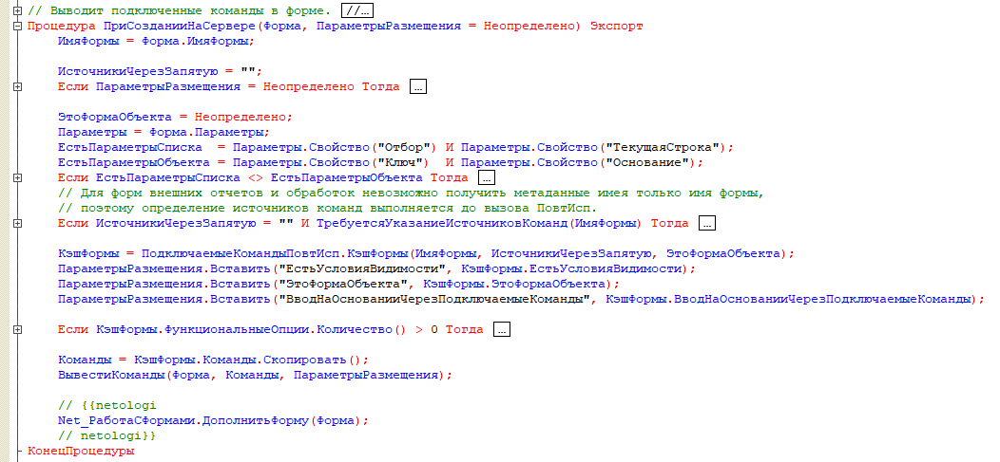
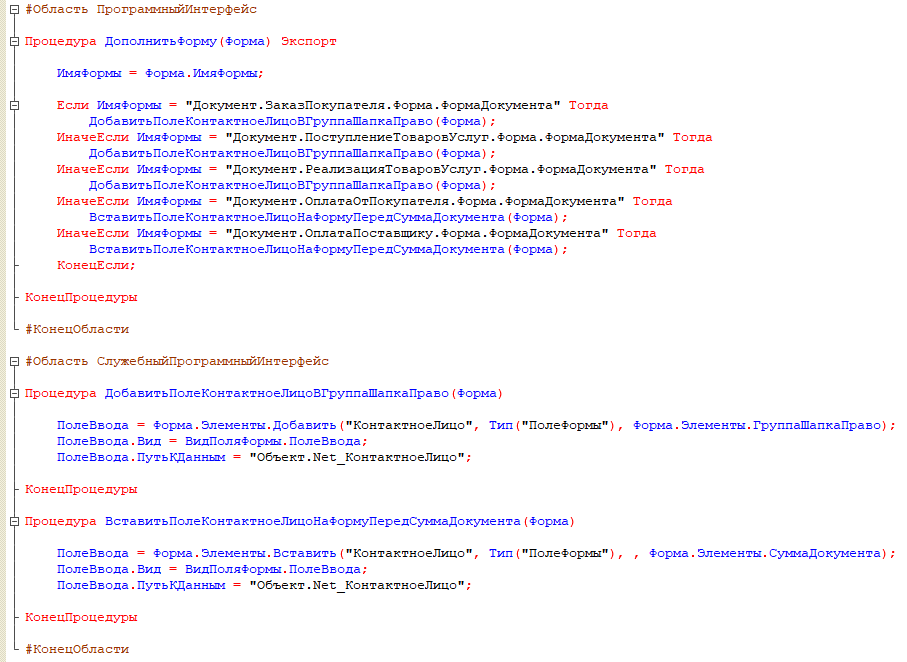

# Домашнее задание к занятию "Внесение изменений в конфигурацию на поддержке"

## Цель задания

1. Научиться правильно вносить корректировки в конфигурации 1С, стоящие на поддержке поставщика.
2. Научиться вносить изменения в конфигурацию, находящуюся на поддержке поставщика.

Данная практика научит вас корректному внесению доработок в конфигурацию 1С, стоящую на поддержке поставщика. Эти навыки пригодятся для реальной работы, когда Вам потребуется внести объемные доработки в конфигурацию.

## Чек-лист готовности к домашнему заданию

- [ ] Установить учебную платформу версии 8.3.22 или больше.
- [ ] Просмотреть материал занятия "Внесение изменений в конфигурацию на поддержке".

## Инструкция к заданию

1. Решите описанные задачи в конфигураторе.
2. Протестируйте решение в пользовательском режиме.
3. Отправьте на проверку в личном кабинете Нетологии один общий файл базы данных (.dt), содержащей решения по обеим задачам. Файл прикрепите в раздел "решение" в практическом задании.

## Задача 1 "Добавление объектов метаданных в конфигурацию, стоящую на поддержке"

### Описание задачи
Вы дорабатываете приложение заказчика, использующего конфигурацию на полной поддержке. Заказчик запросил доработку: для Контрагентов необходимо хранить список контактных лиц.

### Требования к результату
Задание аналогично первой задаче прошлого занятия, однако в данном случае необходимо сделать все то же самое без использования расширения, внося корректировки в конфигурацию.
В данном задании основной проверяемый критерий - правильность внесения доработок.
Технические требования к реализации, а так же порядок решения приведены в [прошлом домашнем задании](homework-11-1.md). 
Дополнительное требование - формы надо дорабатывать, исключительно, программно.

### Процесс выполнения
1. Сохраните результат прошлого домашнего решения в отдельный dt-файл. Он пригодится для следующего домашнего задания
2. После сохранения файла, удалите из базы расширение.

  
Подсказка 1

  Откройте список расширений. Снимите напротив расширения флаг "Активно". Удалите его.

3. Включите для конфигурации возможность изменения.

  
Подсказка 2

  Включите возможность изменения, но не забудьте оставить для всех объектов настройку "Объект поставщика не редактируется".

4. Подумайте, для каких объектов необходимо включить возможность изменения и включите ее (не бойтесь что-то забыть, к этой настройке всегда можно вернуться).

  
Подсказка 3

  Мы будем добавлять объекты-справочники, значит надо разрешить редактировать корень конфигурации и подсистемы, в которые справочники будут включены.
  
  Также, нам надо вносить изменения в документы (добавить для них реквизиты) и в формы документов (однако, тут есть одна хитрость, о которой в одной из подсказок далее).

  
Подсказка 4

  Не выбирайте пункт "Объект поставщика снят с поддержки", используйте "Объект редактируется с сохранением поддержки".
  
  Также, не устанавливайте флаг "Установить для подчиненных", если это не необходимо, настраивайте объекты максимально точечно.

5. Добавьте объекты необходимые для решения задачи.

Так как мы создаем новые справочники, они будут пустыми. Если в прошлой базе Вы создали много данных, попробуйте перенести их при помощи выгрузки из той базы и загрузку в эту (например, при помощи JSON).

  
Подсказка 6

  В общем случае, объекты можно скопировать из расширения, например, открыть его в соседней конфигурации и копировать их. Но следите за тем, чтобы типы данных не сбивались. Например, если Вы скопируете сначала справочник Контактные лица, а потом справочник с должностями, то у реквизита Должность справочника КонтактныеЛица собьется тип данных (будет установлена строка 10 символов), потому что на момент добавления этого справочника, типа СправочникСсылка. Должности в конфигурации не будет.

  Также для справочников придется указать подсистемы, в которые Вы их размещаете.

6. Пропишите необходимый программный код.

  
Подсказка 7

  В форме надо создать элемент формы и установить для него путь к данным. Реквизит отдельно создавать не надо, так как мы его добавили в документОбъект на уровне метаданных.

  
Подсказка 8

  Конечно, программный код можно прописать в модуле формы и для этого включить возможность изменения самой формы, но давайте обратим внимание, что все формы документов, в событии ПриСозданииНаСервере вызывают одну и ту же процедуру общего модуля: 
  
  > ПодключаемыеКоманды.ПриСозданииНаСервере(ЭтотОбъект);
  
  Мы можем использовать это. "ЭтотОбъект" - это наша форма. Все что нам надо сделать - включить возможность изменения для общего модуля, и из этой процедуры вызвать собственный общий модуль:
  

     
  

  
  А в самом этом модуле исходя из имени формы, решать, как ее доработать:
  

     
  

  
  Сам по себе данный способ может вызывать споры, т.к. с одной стороны, мы вносим корректировку в более универсальный механизм, с другой стороны, мы оставляем больше объектов на поддержке типовой конфигурации. Это удобнее, т.к. формы меняются чаще, чем подобные общие модули.
  
  Вы можете выбрать любой способ реализации, который Вам больше нравится.

7. Убедитесь, что все работает аналогично прошлому домашнему заданию.

## Задача 2 "Доработка программного кода в Конфигурации"

### Описание задачи
Задание аналогично второй задаче прошлого занятия, однако в данном случае необходимо сделать все то же самое без использования расширения, внося корректировки в конфигурацию.
В данном задании основной проверяемый критерий - правильность внесения доработок.
Технические требования к реализации, а так же порядок решения приведены в [прошлом домашнем задании](homework-11-1.md).

### Требования к результату
В документ "Заказ покупателя" должно быть добавлено поле "Согласованная скидка", значение, указанное в поле, должно учитываться в документе.

### Процесс выполнения
1. Включите возможность изменения формы документа ЗаказПокупателя.
2. Добавьте в документ необходимый реквизит.
3. Доработайте форму необходимым образом.

  
Подсказка 1

  Все объекты на форму должны быть добавлены программно.

  
Подсказка 2

  Если в прошлом задании, Вы создали собственный общий модуль - пропишите добавление элементов в нем.
  
  Но обработчики событий должны располагаться в самой форме.

  
Подсказка 3

  Не забывайте добавлять комментарии, для выделения меняемого программного кода.

## Пример: 
в результате выполнения этого домашнего задания, у Вас должна получиться база с поведением, аналогичным [прошлому домашнему заданию](examples/HW_11_1_example.md).

------

### Критерии оценки

1. Зачет - выполнены все задания, нет противоречий и нарушения логики. 
2. На доработку - задание выполнено частично или не выполнено, в логике выполнения заданий есть противоречия, существенные недостатки.

*Примерное время выполнения: 45-180 минут*

Все задачи обязательны к выполнению. Пожалуйста, присылайте на проверку все задачи сразу.

Любые вопросы по решению задач задавайте в чате учебной группы.

