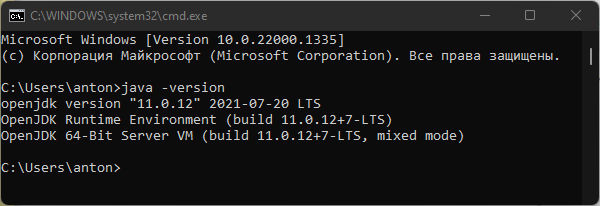
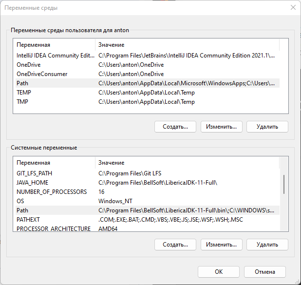
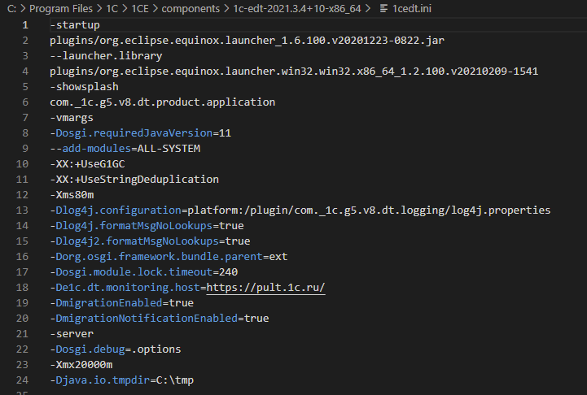
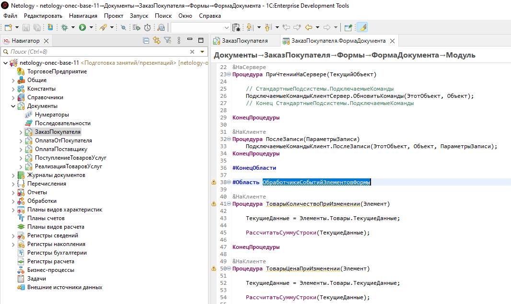

# Задание к занятию "1C:EDT"

## Задание 1. Установка EDT

В качестве отчета по выполнению задания надо отправить скриншоты:
1. Консоли

   

2. Значений переменных среды

   

3. Файла настроек

   

4. Рабочей области EDT

   

