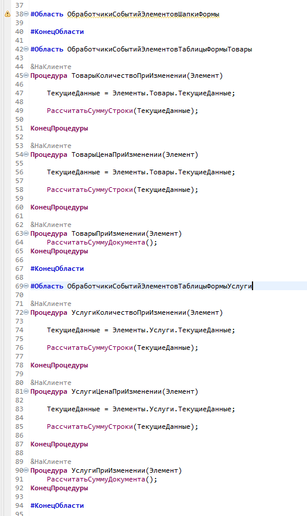
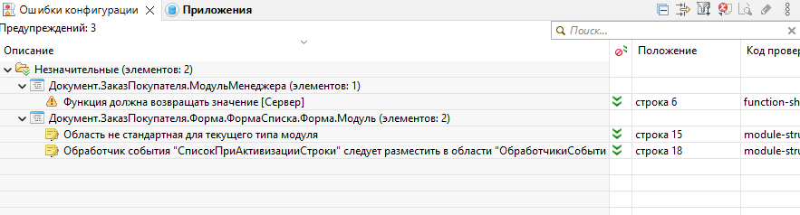

# Задание к занятию "1C:EDT"

## Задание 1. Установка EDT

В качестве отчета по выполнению задания надо отправить скриншоты:
1. Консоли

   

2. Значений переменных среды

   

3. Файла настроек

   

4. Рабочей области EDT

   

## Задание 2. Анализ ошибок конфигурации

1. Для отображения ошибок только по текущему объекту, не забудьте в фильтре ошибок снять флаг "Показывать все" и установить переключатель в значение "Текущий объект"
2. Пришлите скриншот 

   

3. Исправление ошибок. 
3.1. В данном модуле, мы видим, что в 38 строке задана нестандартная область "ОбработчикиСобытийЭлементовФормы" стандарт разработки https://its.1c.ru/db/v8std/content/455/hdoc содержит перечень стандартных областей модуля, и для модуля формы, действительно, не объявлена "ОбработчикиСобытийЭлементовФормы" Но есть область "ОбработчикиСобытийЭлементовШапкиФормы", соответственно, надо переименовать область в модуле

   

3.2. Ошибка "Обработчик события "ТоварыКоличествоПриИзменении" следует разместить в области "ОбработчикиСобытийЭлементовТаблицыФормыТовары"	- строка 41 - Создадим требуемую область и перенесем обработчик в нее. Аналогично поступаем с прочими подобными ошибками:

   

3.3. В итоге, видим, что область "ОбработчикиСобытийЭлементовФормы" осталась пустой, а это тоже ошибка - пустых областей быть не должно, удалим ее.
3.4. Таким образом, в модуле формы документа больше нет ошибок совсем:

   

Подобным образом, можно обработать 1 или несколько модулей. Если какие-то ошибки будут не понятны, не исправляйте их. Следите за тем, чтобы весь функционал оставался рабочим, исправление ошибок не должно приводить к неработоспособности конфигурации.
